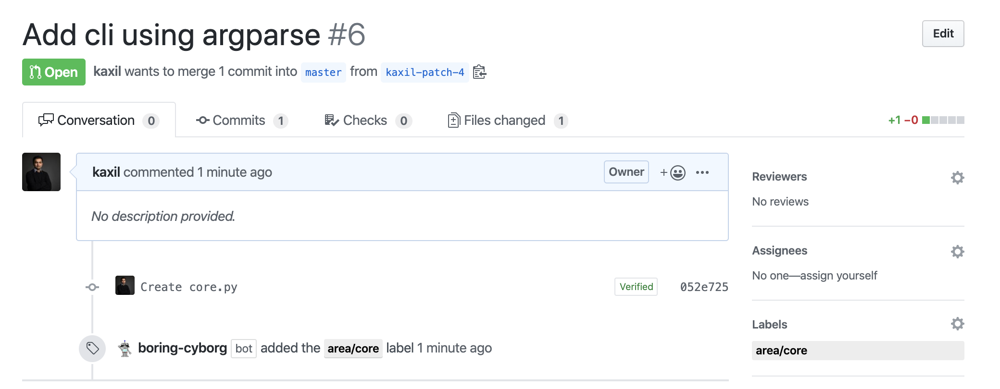

# Boring Cyborg

🤖 A GitHub App built with [Probot](https://github.com/probot/probot) that automatically label PRs, issues and 
performs all the boring operations that you don't want to do.



## Features

* Add labels based on the path of the file that are modified in the PR.

## Usage

1. **[Configure the Github App](https://github.com/apps/boring-cyborg)**
2. After installing the Github app, create `.github/boring-cyborg.yml` in the default branch to enable it
3. It will start scanning for pull requests within few minutes.

```yaml
# Enable "labeler" for your PR that would add labels to PRs based on the paths that are modified in the PR. 
labelPRBasedOnFilePath:
  # Add 'label1' to any changes within 'example' folder or any subfolders
  label1:
    - example/**/*
  
  # Add 'label2' to any file changes within 'example2' folder
  label2: 
    - example2/*

  # Complex: Add 'area/core' label to any change within the 'core' package
  area/core:
    - src/core/*
    - src/core/**/*  
    
  # Add 'test' label to any change to *.spec.js files within the source dir
  test:
    - src/**/*.spec.js  
```

## Setup

```sh
# Install dependencies
npm install

# Run the bot
npm start
```

## Contributing

If you have suggestions for how boring-cyborg could be improved, or want to report a bug, open an issue! We'd love all and any contributions.

For more, check out the [Contributing Guide](CONTRIBUTING.md).

## License

[ISC](LICENSE) © 2020 Kaxil Naik
